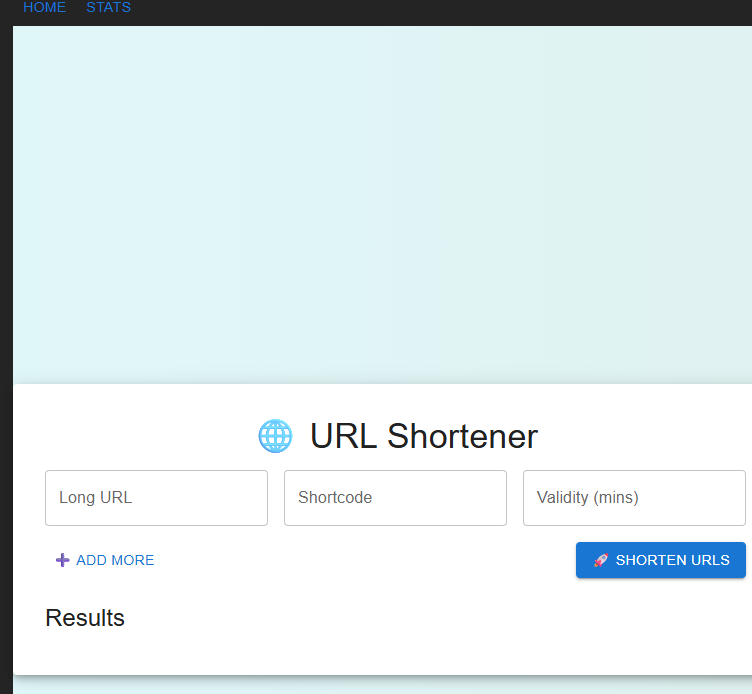
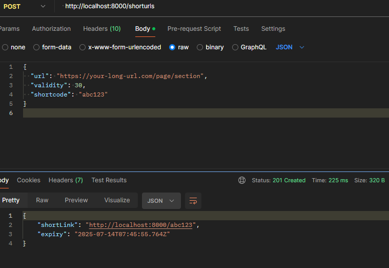
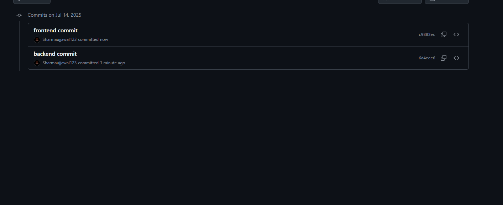

backend/
├── controllers/
│   └── urlController.ts
├── middleware/
│   └── logger.ts        
├── services/
│   └── urlService.ts
├── utils/
│   └── log.ts           
├── db/
│   └── db.ts
├── routes/
│   └── urlRoutes.ts
├── index.ts             
├── .env
└── package.json

frontend/
├── public/
├── src/
│   ├── components/
│   │   ├── ShortenerForm.tsx
│   │   └── StatsViewer.tsx
│   ├── pages/
│   │   ├── Home.tsx
│   │   └── Stats.tsx
│   ├── App.tsx
│   ├── main.tsx
│   └── api.ts           
├── .env
├── index.html
└── vite.config.ts or package.json
# URL Shortener Project

